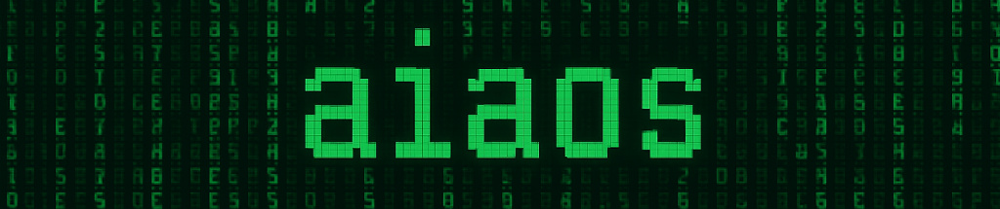
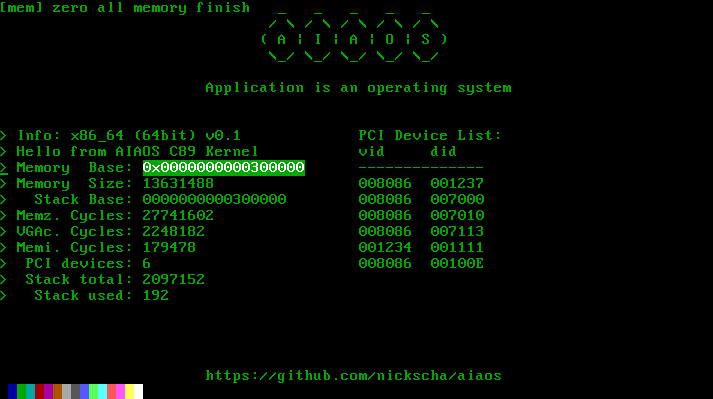

# aiaos

<p align="center">
<a href="https://nickscha.github.io/"></a>
</p>

A C89 nostdlib bare metal 64bit operating system with a custom bootloader.

The name **AIAOS** is a simplification and stands for "Application is an Operating System".
 
> [!WARNING]
> THIS PROJECT IS A WORK IN PROGRESS! ANYTHING CAN CHANGE AT ANY MOMENT WITHOUT ANY NOTICE! USE THIS PROJECT AT YOUR OWN RISK!

## Quick Start

On **Windows** just run the "**build.bat**" file which compiles and links the bootloader and kernel and creates an elf bootable image.

<p align="center">
<a href="https://nickscha.github.io/"></a>
</p>

## Building Windows cross compilation setup

In this section we will build an **x86_64-elf** cross compiler based on GCC using the **MSYS2** subsystem.

Download and Install the MSYS2 package: 
https://www.msys2.org/wiki/MSYS2-installation/
 
Once you have it setup install nasm (needed for assembly files), gcc and other libraries needed for gcc cross compilation:
 
```bat
pacman -S base-devel make nasm gcc mingw-w64-x86_64-gcc mingw-w64-x86_64-qemu git gmp-devel mpfr-devel mpc-devel mpc isl-devel zlib-devel
```

Verify in the MSYS2 shell that they are installed:

```bat
make --version
nasm --version
gcc --version
```

Build x86_64-elf binutils for objcopy and ld linker command:

```bat
git clone --depth 1 https://sourceware.org/git/binutils-gdb.git
cd binutils-gdb
./configure --target=x86_64-elf --prefix=$HOME/opt/cross --disable-nls --disable-werror
make -j8
make install
cd ..
```

Build x86_64-elf gcc cross compiler:

```bat
git clone --depth 1 https://gcc.gnu.org/git/gcc.git gcc-src
cd gcc-src
./contrib/download_prerequisites

mkdir build-gcc
cd build-gcc
../configure --target=x86_64-elf --prefix=$HOME/opt/cross --disable-nls --enable-languages=c --without-headers
make all-gcc -j$(nproc)
make all-target-libgcc -j$(nproc)
make install-gcc
make install-target-libgcc
```

Afterwards you should be able to call these executables:

```bat
x86_64-elf-gcc --version
x86_64-elf-ld --version
x86_64-elf-objcopy --version
```

## TODO

- custom x86_64 assembler integration via las
- NIC stack
